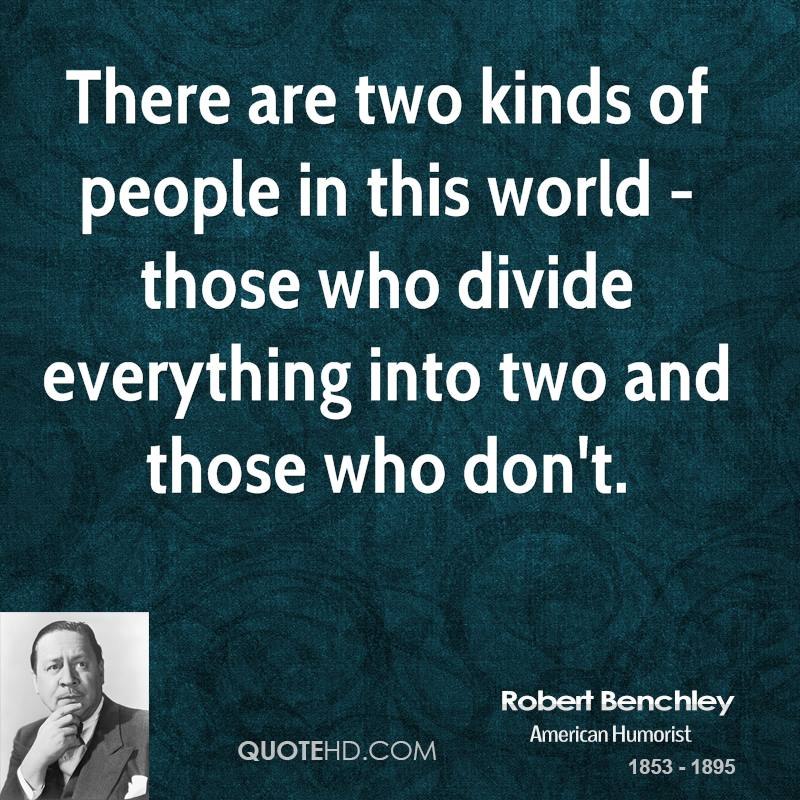

[Previous Chapter: Introduction](https://github.com/pbharathreddy/Machine-Learning/blob/master/README.md)

# Types of Machine Learning Algorithms
There are mainly **3** types of algorithms a machine learning model can be trained:
1. Supervised 
1. Unsupervised
1. Reinforcement

Let’s take an example to understand these terms:

Think about the time when you were a school kid, try to recreate the picture of your typical Math classroom. Even today, I get freaked out to imagine my teacher calling me to solve an example on the blackboard in front of my class! 
So, the problem which you are going to solve on the board might be of the following type:
* Your teacher has solved a problem on the blackboard and has asked you to solve a **similar** one! Hmm, not bad actually. This teacher of yours sounds really good!
* Your teacher has just written a problem and the solution is, well, you have to find out by **yourself**, the only hint is more amount of similar kind of problems given. Your task is to figure out the pattern in those problems and to come up with a solution. Sounds like fun and challenging, this teacher has their own way of teaching!
* Your teacher calls you to solve a problem **without** giving you any hint, you just have to start solving it, they will give you a chocolate if you going on a right track  or else they will give you an extra assignment as a punishment, so you have to figure out how to get more chocolates and fewer assignments as possible, i.e which similar kind of steps to repeat to get a **reward**, this sounds the hardest, your teacher is simply a legend!!

## 1. Supervised learning:
Supervised learning is the first type of problem discussed above. When a model is trained with **features** (problem statement in our example) **along** with the **labels** (solutions of the problem), it is known as supervised learning. It is used to solve types of problems like **classification and regression**.
A classification problem is when our y, the output variable, the dependent variable or any name which you like the best, is a **categorical** variable and using the features you have to predict the label belonging to one class or the other, while a **regression** problem is when the label is a continuous value and not belonging to a certain class, having a big possibility of values. More on that later.

Enough of spoon-feeding! Now let’s go to the second algorithm, unsupervised!

## 2. Unsupervised learning:
The second type is unsupervised learning. When we **only** have features and not labels for training, it is called unsupervised. It can be used to solve the following types of problems:
Clustering
Dimensionality Reduction

### Clustering:
Clustering means categorizing the data points (i.e each row, observation, etc) into a group. Note that we don’t categorize them based on given parameters or labels but it tries to figure out on its own, that’s why it is an unsupervised algorithm. Let’s learn the concept of clustering with a simple example. Imagine that a 3-year-old is given a deck of cards and is given a task to group the cards the way he or she likes. The child starts searching for patterns and sees that each card has either a number or a picture (joker, jack, queen, king, A), a symbol (i.e. spade, ace, heart, and diamond), and color. So there are many possibilities based on which the deck can be divided. He or she is not instructed about how to divide or in how many groups, so that is unsupervised and thus it depends on the child to divide it into 2 groups (based on a number card and picture card, red and black color cards), 4 groups (based on the symbol), or simply 1! If they believe in this:

In short, what the child did in our case is called clustering, more on that later.
