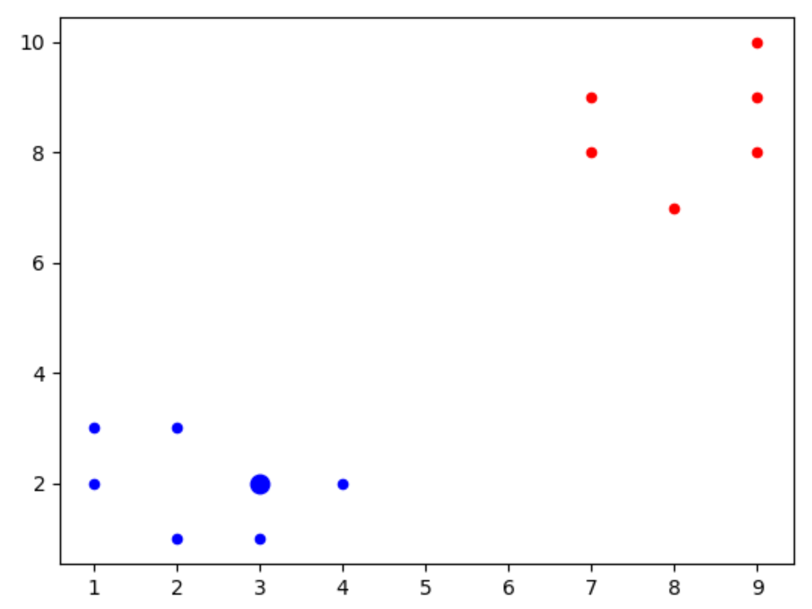

## K-nearest neighbors
This is a clasification algorithim that helps us clasify a new data point to one of the previously known categories. It is a supervised learning algorithm. Now a simple example would be, we have sets of data that have +ve and -ve cases of cancer. Already lables yes or no. Now we a good extimate of feature set for which the result is +ve or -ve. Now how would be solve a k-nearest problem.
Lets do this with the following simple example. 
1. We have reds(r) and blues(b) with the folloing features: {"b": [[1,2],[2,3],[2,1],[3,1],[1,3],[4,2]], "r": [[9,10],[7,9],[9,9],[7,8],[8,7],[9,8]]}
2. Now we would like to predict to which category [3,2] belongs to.
3. We find the euclidean distance to all the point from the point to predict.
4. We then assign the result of the closest know dataset result to the dataset whose result we would like to predict.
Here is the code to impliment the above:
```
import numpy as np
import matplotlib.pyplot as plt
from collections import Counter

def kNear(data,predict,k):
    dis = []
    for i in data:
        for j in data[i]:
            dis.append([np.linalg.norm(np.array(j)-np.array(predict)),i])


    votes = [i[1] for i in sorted(dis[:k])]
    result = Counter(votes).most_common(1)
    return result[0][0]


data = {"b": [[1,2],[2,3],[2,1],[3,1],[1,3],[4,2]], "r": [[9,10],[7,9],[9,9],[7,8],[8,7],[9,8]]}
predict = [3,2]

result = kNear(data,predict,2)


[[plt.scatter(j[0],j[1],s=20,color=i) for j in data[i] ]for i in data]
plt.scatter(predict[0],predict[1],s=80,color=result)
plt.show()
```

## Result:

