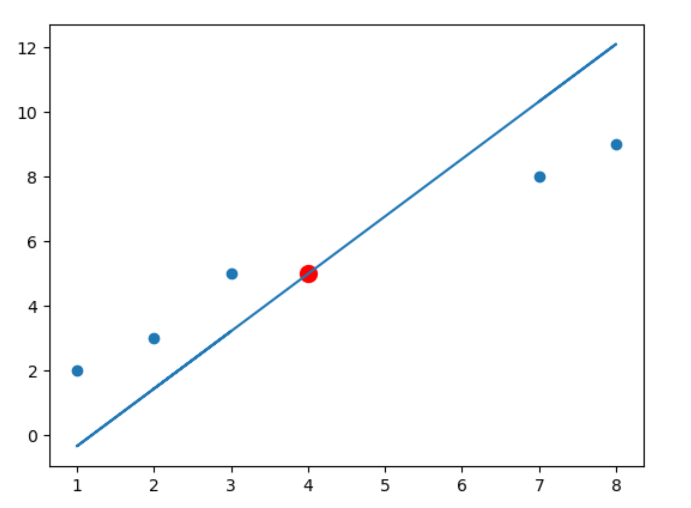
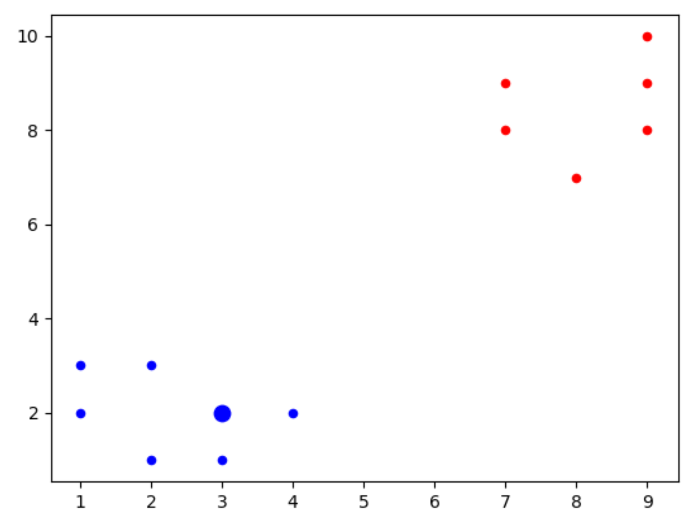

# Machine-Learning
A detailed guid into machine learning with python.

Note-A pre-requisite to understanding the below content will be a basic statistics and probability, also fundamentals of Python. I will try to keep that math simple and will explain any tangents as we progress. 

## Before we dwell into machine learning, let's start by understanding what machine learning essentially is.

  Machine learning is essentially trying to program a computer to perform tasks without explicitly having programed it to do so. This is acheived with help of algorithims and statistical modeling that help it solve problems by identifying patterns and making inferences. 
  This acheived by first writing an algorithm that trains itself of a large data set to idenity patterns within that data and then superimposing these patterns on a new data in question. 
  
## Now how to go about doing all that is stated above?

  To get have better intution and uderstanding of what we should be doing let's take into cosideration a hypothetical company Company X. Company X is very new to that market and started of this a IPO(initial public offering) of 1$. The share value of the company has been growing at a steady pase of 10$ every month. Now with the help of some simple linear alzebra we can easly model a graph or line that will best depict this growth. Now if we were to represent the above example in the form of a linear equation it would be Y = 10 * X + 1. We can now use this line to make predictions about the future share value of company X. Well in this case we will be able to exactly predict the share price of company X at every month but unfortunately real world senarions are not this forgiving. Thus we resort to making best possible predictions. This we term as linear regression. This is one of the fundaments of machine learning and this is going to be our entry point into machine learning.  

  
### So what is linear regression?

  From our above example I think we all now have a decent understanding of what linear regression is. It is simply **finding the best fit line** for a give set of data points and making predictions of of it for new incomming data.
  Here are the fundamental steps involved in linear regression: (We will be discussing every step in detail as we go ahead).
  1. Clean the data.
  2. Take a training set and isolate it from the test set.
  3. Train the algorithm on the training data and get the best fit line by minimizing the mean square error (or an estimator of your choice).
  4. Test the algorithims performance with the test data. 
  5 Use the algorithm to make future predictions.
  
The best way to learn anything is through hands on experience. So we are now going to impliment the above steps on a data set. For this purpose we are going to create random data points and draw a regression line on them. 

#### Step 1: create data.
  Create random points. You can use the random function for this or just create list of random points. In this case let the points be:
  [[2,3], [3,5], [1.2], [8,9], [7,8]].
#### Step 2: clean the data.
  The data in this case has no nulls hence there is no reason remove any null values. If there were nulls we could do the following things. 
  1. Replace the null vaules with the average of the particular field or column.
  2. If the dataset that we have is large enough then we can just drop the row with the null value.
#### Step 3: draw the best fit line for the data.
  ```
  import numpy as np
  from statistics import mean
  from matplotlib import pyplot as plt

  def findSlope(xs,ys):
      xm = mean(xs)
      ym = mean(ys)
      xy = np.append(xs,ys)
      xym = mean(xy)
      xSm = mean(np.square(xs))

      slope = ((xm*ym) - xym)/(xSm - xm*xm)

      b = ym - slope*xm
      return slope,b

  data = [[2,3], [3,5], [1,2], [8,9], [7,8]]

  xs   = []
  xs.append([data[i][0] for i in range(len(data))])

  ys = []
  ys.append([data[i][1] for i in range(len(data))])

  xs = np.array(xs[0])
  ys = np.array(ys[0])

  slope, b = findSlope(xs,ys)

  lxs = []
  lxs.append([(slope*i + b) for i in xs])

  lxs = np.array(lxs[0])

  plt.scatter(xs,ys)
  plt.plot(xs,lxs)
  plt.show()
```
## Result:


Now we can see the best fit line in the above image. We can now plot new data points with the help of this line. For example if we were given a point along the x-axis all we would have to do is replace x the line equation (y = m * x + c) of the above line to predict y.

```
#point to predict
predictx = 4
predicty = slope*predictx + b
```


### Creating own data.
Now lefts create our own data set over which we can test our algorithim. While doing so let's go through some important concepts that are necessary while analyzing the data:
1. Variance, this will give us the range of the data. Variance informally is the measure of how far a set of numbers are spread out from their mean.
2. Correlation, this lets us predict the slope of the graph (best fit regression line). If correlation is +ve then the graph has a +ve slope and vise-versa.
Now lets get into making our own data:
```
def rData(count,step,variance,correlation=False):
  result = []
  y = []
  val = 1
  for i in range(count):
    y.append(random.randrange(-variance,variance)+val)
    if correlation and correlation=="pos":
      val+=step
    elif correlation and correlation=="neg":
      val-=step
  x = [i for i in range(len(y))]

  [result.append([x[i],y[i]]) for i in range(len(x))]
  return result

data = rData(70,1,50,"neg")
```
## Result


## K-nearest neighbors
This is a clasification algorithim that helps us clasify a new data point to one of the previously known categories. It is a supervised learning algorithm. Now a simple example would be, we have sets of data that have +ve and -ve cases of cancer. Already lables yes or no. Now we a good extimate of feature set for which the result is +ve or -ve. Now how would be solve a k-nearest problem.
Lets do this with the following simple example. 
1. We have reds(r) and blues(b) with the folloing features: {"b": [[1,2],[2,3],[2,1],[3,1],[1,3],[4,2]], "r": [[9,10],[7,9],[9,9],[7,8],[8,7],[9,8]]}
2. Now we would like to predict to which category [3,2] belongs to.
3. We find the euclidean distance to all the point from the point to predict.
4. We then assign the result of the closest know dataset result to the dataset whose result we would like to predict.
Here is the code to impliment the above:
```
import numpy as np
import matplotlib.pyplot as plt
from collections import Counter

def kNear(data,predict,k):
    dis = []
    for i in data:
        for j in data[i]:
            dis.append([np.linalg.norm(np.array(j)-np.array(predict)),i])


    votes = [i[1] for i in sorted(dis[:k])]
    result = Counter(votes).most_common(1)
    return result[0][0]


data = {"b": [[1,2],[2,3],[2,1],[3,1],[1,3],[4,2]], "r": [[9,10],[7,9],[9,9],[7,8],[8,7],[9,8]]}
predict = [3,2]

result = kNear(data,predict,2)


[[plt.scatter(j[0],j[1],s=20,color=i) for j in data[i] ]for i in data]
plt.scatter(predict[0],predict[1],s=80,color=result)
plt.show()
```

## Result:

