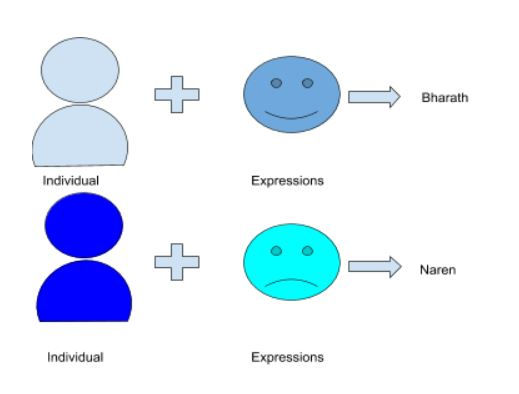

# Machine-Learning
_A detailed guid into machine learning with python._

**Note:-** A pre-requisite to understanding the below content is basic knowledge of statistics and probability, also fundamentals of Python. I will try to keep that math simple and will explain any tangents as we progress. 

## Introduction
**M**achine learning simply put is when a machine learns to perform tasks without explicitly being programmed to do so! This is achieved with the help of the algorithms and statistical modeling; it solves problems by identifying patterns and making inferences. First, we need to write an algorithm that trains itself from large data to identify patterns and then superimposing these patterns on new data in question.

You might think, what is the requirement to learn about ML, or even why a machine should learn, because at the end of the day it will be threat to our jobs, right? But, we need to understant the sector that ML predominantly influences. ML is not on the hunt for jobs, it's only out to take over the mundane and repetitive task that also require great accuracy and precision. This gives us humans more time that can be invested in things that are more intellectually demanding (And honestly ask yourself, would you rather let your emotions translate into a captivating song or spend a day cutting a peice of cloth precisely to one tenth of a millimeter). Let's face it there are certain things that machines are just better at than us and vice-versa. That is why we need to find a state of equilibrium or yin and yang between humans and machines.

 

The main element required for the machine to learn is, well, something which is to be learned. And, that something is known as **data**.

>“Data! data! data!" he cried impatiently. "I can't make bricks without clay.”
>― Arthur Conan Doyle, The Adventure of the Copper Beeches (Sherlock Holmes) 
 
Since the very beginning, we have recognized the importance of the data, that’s why we developed statistical methods, surveys and stuff to collect the data and understand how to improve the current system, what to update, what to omit, etc. Initially, we did it using pen and paper, so the quantity of the data at the end, would not be of enough size and it would not give us a profound result.
Then computers came and with it came the thing which changed the field in a sense of reachability, the internet! Through the internet, it was easy to reach people out there, i.e. without going door to door asking them about surveys, they were able to reach a large amount of audience. That way, the amount of data got increased.

Due to a high amount of data, now came the time when the processing speed of computers wasn’t really at par with the amount available. It used to take a really long time to execute a task with this big amount of data. But we also got a solution for that, we updated our hardware technology and using the new technologies like Big data, distributed systems, etc. we were able to cope up with the amount of data we are receiving. With the rise of **IoT** (Internet of things), now even known as IoE where **E** stands for Everything(!), computers and cell phones were no longer the only devices connected with the web but even small tiny smart devices, sensors also contributed with their 6-digit IP address! The amount of data collected today, and 10 years before can’t be even compared! I could go on and on with the importance and place of ML in our present world but now I will hold my horses and will start the journey towards learning ML in a simplified way.

Machine Learning is a branch of Artificial Intelligence. The process of ML is the same as the learning process of a human child. In the initial phases, it learns through one feature, i.e. whatever input it is getting, in the next phase it combines multiple inputs to make the decision and that’s how it gathers more and more data, thus more features/inputs, it considers to make the decision which gives a high accuracy output.

Let’s take an example to understand the phases of learning, say we want to train our machine learning model to able to detect different people, the learning phases for our model will be the following:

### Phase 1:
It figures out that it has detected a human figure but it can’t distinguish between them yet

 

### Phase 2:
In the last phase, it took only 1 input, that is the shape of the object, now it is taking 2, the expressions as well, so now it is able to distinguish between 2 different entries

 

### Phase 3:
In this phase, the model will gather the predicted data for future reference (training), It labels these findings so here the individual and expressions are known as **features** and Person 1-2  is known as **labels** and the gathered data is called an **observation**, in simple words, rows of a database.

That is how a machine learning model learns, just like a human child! Now there are more than one ways it learns. Namely,
1. Supervised learning
1. Unsupervised learning
1. Reinforcement Learning

We will discuss these types in the next chapter.

[Next Chapter: Types of ML Algorithms](https://github.com/pbharathreddy/Machine-Learning/tree/master/Introduction/typesOfMLAlgorithms) 
 

