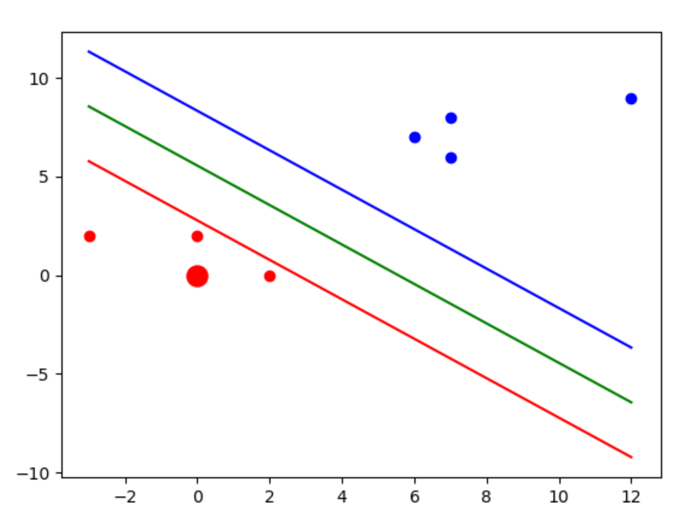

# Support Vector Machine

Support Vector Machine or svm is a convex optimization problem. 

```
import matplotlib.pyplot as plt
import numpy as np
class SVM:
    def __init__(self, data):
        self.fit(data)

    def fit(self, data):
        allData = []
        self.finalParam = []

        for i in data:
            for featureList in data[i]:
                for feature in featureList:
                    allData.append(feature)
        self.set_Max = max(allData)
        self.set_Min = min(allData)
        allData = None

        cord = [[1, 1],
                [1, -1],
                [-1, 1],
                [-1, -1]]

        latestOpt = self.set_Max * 10
        w = [latestOpt, latestOpt]
        stepSize = 5

        optimized = False
        optList = {}

        step_Size = [self.set_Max * .01,
                     self.set_Max * .001,
                     self.set_Max * .0001]

        for step in step_Size:
            while not optimized:
                for b in range(-1 * self.set_Max, self.set_Max, stepSize):
                    for orientation in cord:
                        neverMnd = True
                        w_t = np.array(w) * np.array(orientation)
                        for prop in data:
                            for feature in data[prop]:
                                # yi(xi.w+b)>=1
                                if prop * (np.dot(np.array(w_t), np.array(feature)) + b) >= 1:
                                    neverMnd = False
                                    break

                        if neverMnd:
                            optList[np.linalg.norm(w_t)] = [w_t, b]

                    if w[0] < 0:
                        optimized = True
                    else:
                        w = np.array(w) - step

        self.finalParam = optList.get(min(optList.keys()))
        print(optList.get(min(optList.keys())), optList)
        return optList.get(min(optList.keys()))

    def predict(self, newPoint):
        # w.xi+b = ?
        print(self.finalParam)
        return np.dot(np.array(self.finalParam[0]), np.array(newPoint)) + self.finalParam[1]

    def visualize(self, data, newPoint):
        self.fit(data)
        new = ""
        x, y, z = [], [], []
        for i in data:
            for j in data[i]:
                x.append(j[0])
                y.append(j[1])
                if i == -1:
                    z.append("b")
                else:
                    z.append("r")
        [plt.scatter(x[i], y[i], color=z[i]) for i in range(len(z))]
        if self.predict(newPoint) >= 1:
            new = "b"
        else:
            new = "r"
        plt.scatter(newPoint[0], newPoint[1], color=new, s=150)

        def hyperPlane(x, w, b, v):
            return (-w[0] * x - b + v) / w[1]

        p11 = hyperPlane(self.set_Max, self.finalParam[0], self.finalParam[1], 1)
        p12 = hyperPlane(self.set_Min, self.finalParam[0], self.finalParam[1], 1)

        p21 = hyperPlane(self.set_Max, self.finalParam[0], self.finalParam[1], -1)
        p22 = hyperPlane(self.set_Min, self.finalParam[0], self.finalParam[1], -1)

        p01 = hyperPlane(self.set_Max, self.finalParam[0], self.finalParam[1], 0)
        p02 = hyperPlane(self.set_Min, self.finalParam[0], self.finalParam[1], 0)

        plt.plot([self.set_Max, self.set_Min], [p11, p12], color="b")
        plt.plot([self.set_Max, self.set_Min], [p21, p22], color="r")
        plt.plot([self.set_Max, self.set_Min], [p01, p02], color="g")

        plt.show()

data = {1: [[-3, 2], [2, 0], [0, 2]], -1: [[7, 8], [12, 9], [6, 7],[7,6]]}
temp = SVM(data)
temp.visualize(data, [0, 0])
```


